# Symbiote — Diagrama Estrutural

Este diagrama apresenta a arquitetura de classes do Symbiote Kernel, o orquestrador central do sistema. O `SymbioteKernel` segue o padrao **composicao sobre heranca** — ele nao herda de nada, mas compoe todas as dependencias que precisa. Cada componente e injetado via ports (interfaces Protocol), permitindo substituicao e testes isolados.

O nucleo se organiza em 5 dominios:

- **Identidade e Sessao**: quem e o agente, qual a conversa ativa
- **Memoria e Conhecimento**: o que o agente sabe e lembra
- **Ambiente e Ferramentas**: o que o agente pode fazer
- **Execucao (Runners)**: como o agente raciocina e age
- **Evolucao (Harness)**: como o agente melhora ao longo do tempo

```mermaid
classDiagram
    direction TB

    %% ── Kernel ────────────────────────────────────────────────
    class SymbioteKernel {
        -_storage: SQLiteAdapter
        -_identity: IdentityManager
        -_sessions: SessionManager
        -_memory: MemoryStore
        -_knowledge: KnowledgeService
        -_environment: EnvironmentManager
        -_tool_gateway: ToolGateway
        -_context_assembler: ContextAssembler
        -_runner_registry: RunnerRegistry
        -_reflection: ReflectionEngine
        -_dream_engine: DreamEngine
        -_capabilities: CapabilitySurface
        -_harness_versions: HarnessVersionRepository
        +message(session_id, content) str
        +close_session(session_id) Session
        +dream(symbiote_id, dry_run) DreamReport
        +create_symbiote(name, role) Symbiote
    }

    %% ── Domain Models ─────────────────────────────────────────
    class Symbiote {
        +id: str
        +name: str
        +role: str
        +persona_json: dict
        +behavioral_constraints: list
        +status: str
    }

    class Session {
        +id: str
        +symbiote_id: str
        +goal: str
        +status: str
        +external_key: str
        +summary: str
    }

    class Message {
        +id: str
        +session_id: str
        +role: str
        +content: str
    }

    class MemoryEntry {
        +id: str
        +symbiote_id: str
        +type: str
        +category: str
        +scope: str
        +content: str
        +tags: list
        +importance: float
        +source: str
        +confidence: float
        +last_used_at: datetime
        +is_active: bool
    }

    class EnvironmentConfig {
        +symbiote_id: str
        +tool_mode: str
        +tool_loading: str
        +context_mode: str
        +memory_share: float
        +knowledge_share: float
        +max_tool_iterations: int
        +dream_mode: str
        +dream_max_llm_calls: int
    }

    %% ── Ports (Interfaces) ────────────────────────────────────
    class LLMPort {
        <<Protocol>>
        +complete(messages, config, tools) str | LLMResponse
    }

    class StoragePort {
        <<Protocol>>
        +execute(sql, params) Cursor
        +fetch_one(sql, params) dict
        +fetch_all(sql, params) list
    }

    class MemoryPort {
        <<Protocol>>
        +store(entry) str
        +get(id) MemoryEntry
        +search(query) list
        +get_relevant(intent) list
        +deactivate(id) None
    }

    %% ── Identity & Session ────────────────────────────────────
    class IdentityManager {
        +create(name, role) Symbiote
        +get(id) Symbiote
        +update_persona(id, persona) Symbiote
    }

    class SessionManager {
        +start(symbiote_id, goal) Session
        +close(session_id) Session
        +add_message(session_id, role, content) Message
        +get_messages(session_id) list
    }

    %% ── Memory & Knowledge ────────────────────────────────────
    class MemoryStore {
        +store(entry) str
        +get(id) MemoryEntry
        +search(query) list
        +get_relevant(intent) list
        +get_by_type(symbiote_id, type) list
        +deactivate(id) None
    }

    class KnowledgeService {
        +register_source(symbiote_id, name, content) KnowledgeEntry
        +query(symbiote_id, theme) list
    }

    class WorkingMemory {
        +session_id: str
        +recent_messages: list
        +current_goal: str
        +update_message(msg) None
        +snapshot() dict
    }

    %% ── Environment & Tools ───────────────────────────────────
    class EnvironmentManager {
        +configure(symbiote_id, ...) EnvironmentConfig
        +get_config(symbiote_id) EnvironmentConfig
        +get_dream_mode(symbiote_id) str
    }

    class ToolGateway {
        +register_tool(id, handler) None
        +execute_tool_calls(calls) list~ToolCallResult~
        +get_descriptors(tags) list
    }

    class PolicyGate {
        +check(symbiote_id, tool_id) PolicyResult
        +execute_with_policy(...) ToolResult
    }

    %% ── Context Assembly ──────────────────────────────────────
    class ContextAssembler {
        +build(session_id, symbiote_id, input) AssembledContext
    }

    class AssembledContext {
        +persona: dict
        +relevant_memories: list
        +relevant_knowledge: list
        +available_tools: list
        +tool_mode: str
        +total_tokens_estimate: int
    }

    %% ── Execution ─────────────────────────────────────────────
    class CapabilitySurface {
        +learn(symbiote_id, content) MemoryEntry
        +teach(symbiote_id, query) str
        +chat(symbiote_id, content) str
        +work(symbiote_id, task) dict
        +show(symbiote_id, query) str
        +reflect(symbiote_id) dict
    }

    class RunnerRegistry {
        +register(runner) None
        +select(intent) Runner
    }

    class ChatRunner {
        +run(context) RunResult
        -_run_instant(context) RunResult
        -_run_loop(context) RunResult
    }

    %% ── Evolution & Dream ─────────────────────────────────────
    class HarnessVersionRepository {
        +get_active(symbiote_id, component) str
        +create_version(symbiote_id, component, content) int
        +update_score(symbiote_id, component, score) None
    }

    class DreamEngine {
        +should_dream(symbiote_id, mode) bool
        +dream(symbiote_id, mode) DreamReport
        +dream_async(symbiote_id, mode) None
    }

    class ReflectionEngine {
        +reflect_session(session_id, symbiote_id) ReflectionResult
    }

    %% ── Relationships ─────────────────────────────────────────
    SymbioteKernel *-- IdentityManager
    SymbioteKernel *-- SessionManager
    SymbioteKernel *-- MemoryStore
    SymbioteKernel *-- KnowledgeService
    SymbioteKernel *-- EnvironmentManager
    SymbioteKernel *-- ToolGateway
    SymbioteKernel *-- ContextAssembler
    SymbioteKernel *-- RunnerRegistry
    SymbioteKernel *-- ReflectionEngine
    SymbioteKernel *-- DreamEngine
    SymbioteKernel *-- CapabilitySurface
    SymbioteKernel *-- HarnessVersionRepository

    MemoryStore ..|> MemoryPort
    ToolGateway --> PolicyGate
    ContextAssembler --> MemoryStore
    ContextAssembler --> KnowledgeService
    ContextAssembler --> ToolGateway
    ContextAssembler --> EnvironmentManager
    ChatRunner --> ToolGateway
    ChatRunner --> WorkingMemory
    RunnerRegistry --> ChatRunner

    IdentityManager --> Symbiote : manages
    SessionManager --> Session : manages
    SessionManager --> Message : manages
    MemoryStore --> MemoryEntry : persists
    EnvironmentManager --> EnvironmentConfig : manages
    ContextAssembler --> AssembledContext : builds
    DreamEngine --> MemoryStore : reads/writes
```

## Notas

- **Composicao pura**: o Kernel nao tem logica de negocio propria — ele delega tudo. `message()` chama `capabilities.chat()`, que chama `ChatRunner.run()`, que chama `ToolGateway.execute_tool_calls()`.
- **Ports**: `LLMPort`, `StoragePort` e `MemoryPort` sao Protocols (structural typing). Isso permite trocar o adapter de LLM (OpenAI, Anthropic, local) sem mudar nenhum componente interno.
- **EnvironmentConfig** e o "painel de controle" por symbiote — define tool_mode, context_mode, memory_share, dream_mode e dezenas de outros parametros.
- **DreamEngine** foi adicionado como composicao lazy (criado no primeiro uso) para nao impactar sessoes que nao usam dream mode.
