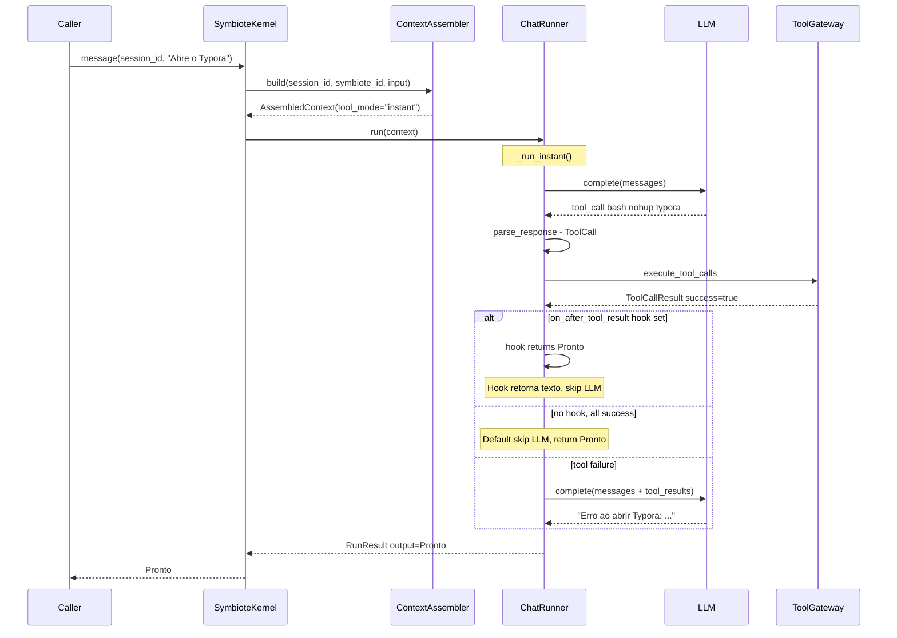
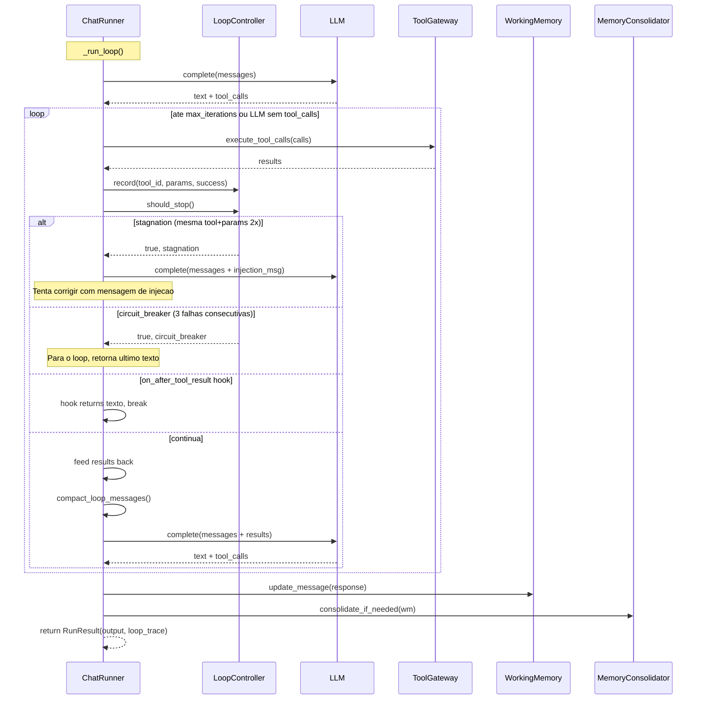
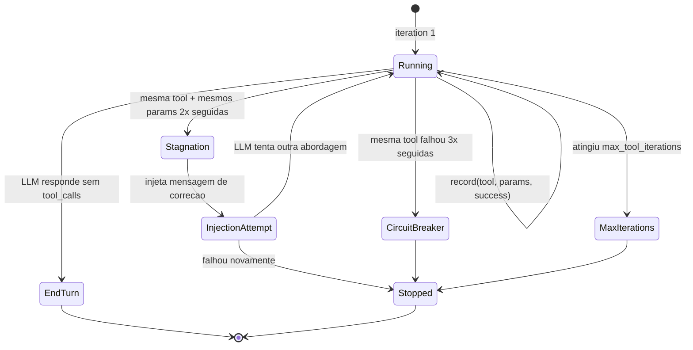
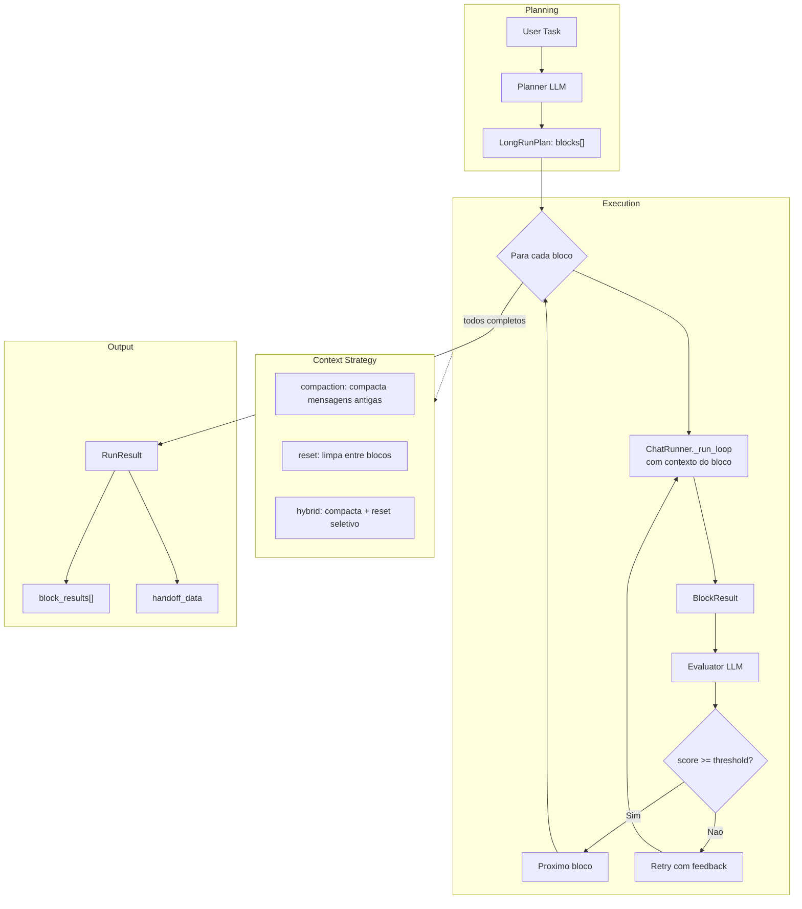
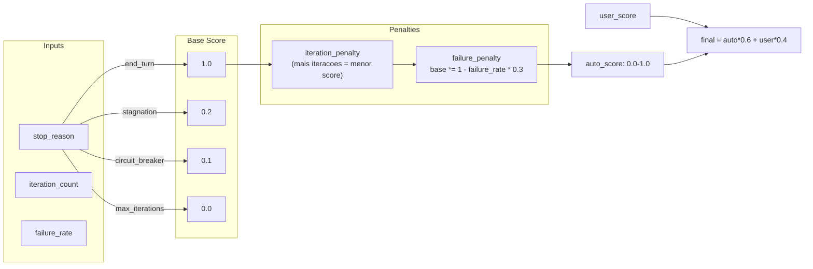

# Symbiote — Modos de Execucao

O Symbiote suporta 4 modos de execucao (`tool_mode`), cada um otimizado para um tipo de tarefa diferente. O modo e definido por symbiote via `EnvironmentConfig.tool_mode` e pode ser `auto` (resolvido dinamicamente pelo `ContextAssembler`).

## Visao Geral dos Modos

| Modo | Iteracoes | Uso tipico | Latencia |
|------|-----------|------------|----------|
| `instant` | 1 (sem loop) | Comandos rapidos, fire-and-forget | ~1-3s |
| `brief` | ate 10 | Tarefas conversacionais com tools | ~3-30s |
| `long_run` | Planner → N blocos | Tarefas complexas multi-etapa | minutos |
| `continuous` | sem limite, dias | Agente persistente, opera continuamente | horas-dias |

## Fluxo de Execucao — Instant Mode

No modo `instant`, o ChatRunner faz **uma unica chamada LLM** seguida de **uma unica rodada de tools** (sem loop). Ideal para o OS Agent do SymTalk, onde o usuario pede "Abre o Typora" e a acao e imediata.

O hook `on_after_tool_result` permite que o caller (ex: SymTalk) decida se o resultado da tool encerra o fluxo sem chamar o LLM novamente.

## Fluxo de Execucao — Brief Mode (Loop)

No modo `brief`, o ChatRunner entra num **loop iterativo**: chama o LLM, executa tools, alimenta os resultados de volta ao LLM, e repete ate o LLM responder sem tool calls, ou o `LoopController` detectar um problema.

## LoopController — Guardiao do Loop

O `LoopController` protege contra tres cenarios degenerados:

## Long-Run Mode (Planner → Blocos → Evaluator)

No modo `long_run`, a execucao e dividida em **blocos planejados**. Um Planner LLM gera o plano, cada bloco roda como uma mini-sessao `brief`, e um Evaluator LLM avalia a qualidade de cada bloco. O `context_strategy` controla como o contexto e gerenciado entre blocos.

## Scoring Automatico

Cada sessao recebe um score automatico baseado no `LoopTrace`:

## Notas

- O modo `auto` e resolvido pelo `ContextAssembler._resolve_auto_mode()` baseado em heuristicas do input do usuario (ex: "pesquise" → long_run, "abra" → instant).
- O `on_after_tool_result` hook (adicionado nesta versao) permite ao caller interceptar o resultado das tools e decidir se o loop deve parar — essencial para o SymTalk evitar a chamada LLM extra em fire-and-forget.
- O `MemoryConsolidator` roda em background thread apos cada resposta do ChatRunner, garantindo que sessoes longas nao estourem o contexto.
