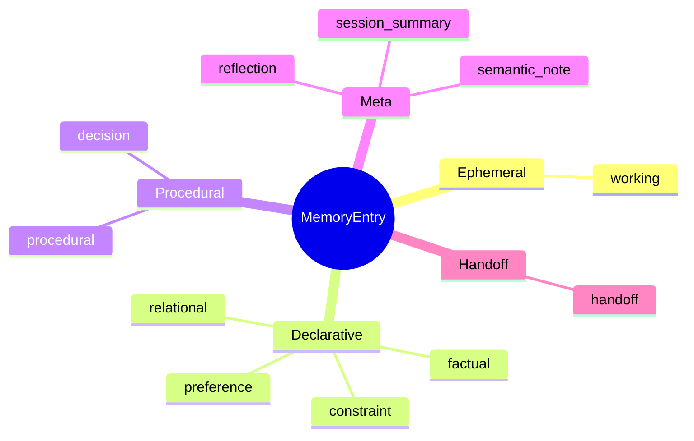
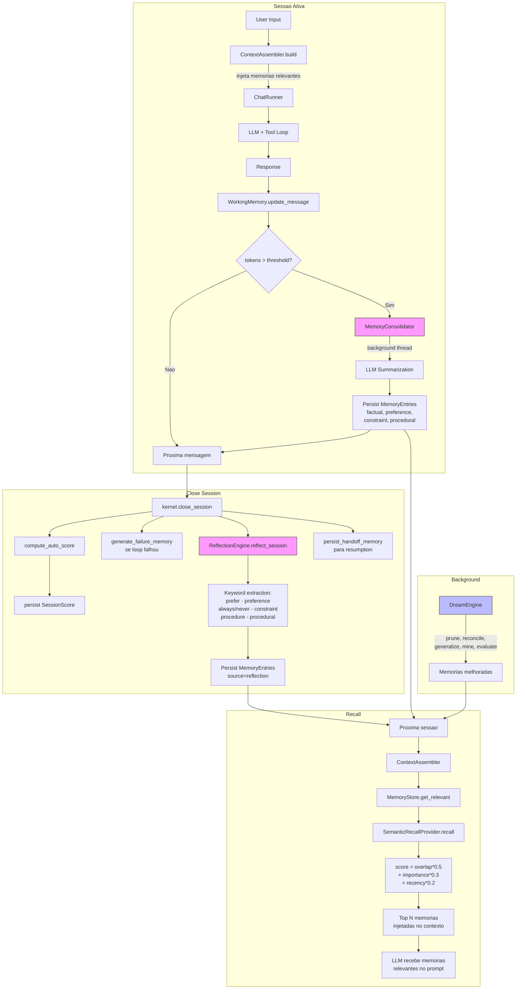
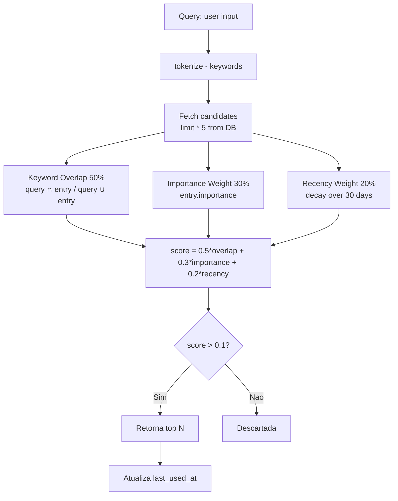
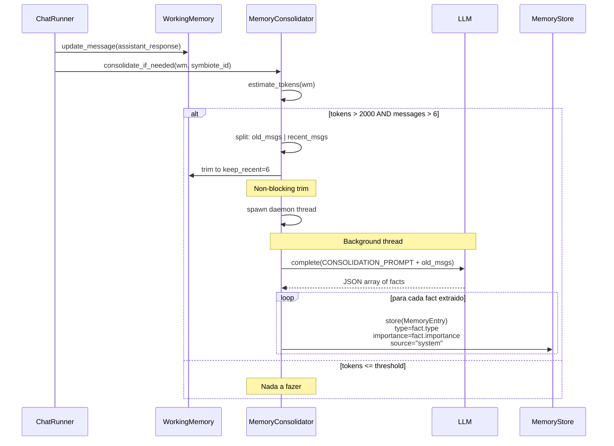
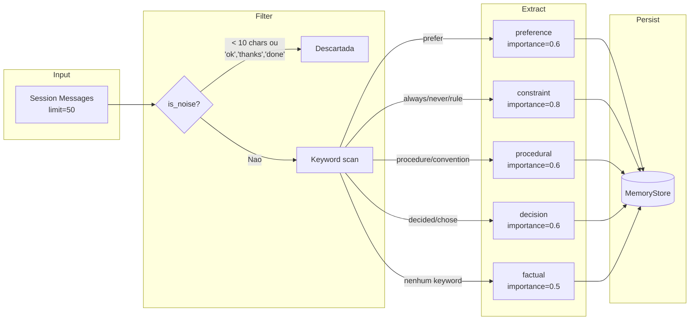
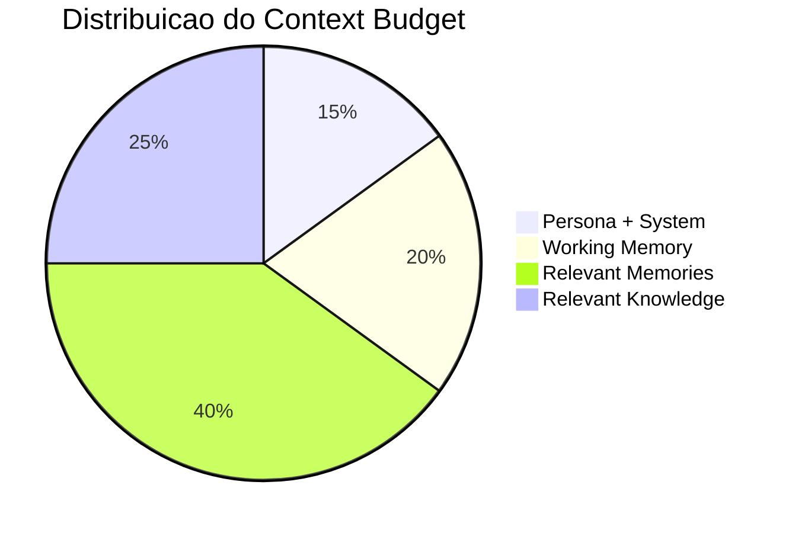
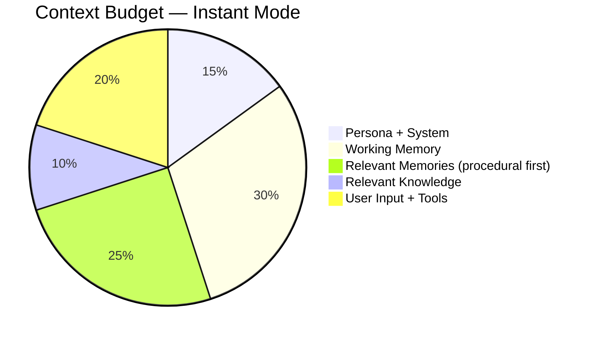

# Symbiote — Memoria e Aprendizado

O Symbiote tem um sistema de memoria em camadas inspirado na neurociencia cognitiva: **memoria de trabalho** (curto prazo, dentro da sessao), **memoria de longo prazo** (persistida em SQLite), **consolidacao** (transferencia do curto para o longo prazo), e **reflexao** (extracao de conhecimento duravel pos-sessao).

## Taxonomia de Memorias

O `MemoryEntry` suporta 10 tipos, organizados em 5 categorias:

Cada memoria tem **importance** (0-1), **confidence** (0-1), **source** (user/system/reflection/inference), **scope** (global/session/project), e **tags** para clustering.

## Pipeline Completo de Aprendizado

## Memoria de Trabalho vs Longo Prazo

```mermaid
flowchart LR
    subgraph WorkingMemory
        direction TB
        WM1[recent_messages: list<br/>max 20, trimmed por turno]
        WM2[current_goal: str]
        WM3[active_plan: str]
        WM4[active_files: list]
        WM5["snapshot() - dict"]
    end

    subgraph MemoryStore
        direction TB
        MS1[(SQLite: memory_entries)]
        MS2[store / get / search]
        MS3["get_relevant - recall scoring"]
        MS4["get_by_type / get_by_category"]
        MS5["deactivate - soft delete"]
    end

    subgraph Consolidator
        direction TB
        MC1[token_threshold: 2000]
        MC2[keep_recent: 6 messages]
        MC3[LLM summarization prompt]
        MC4[daemon thread]
    end

    WorkingMemory -->|"overflow\n(tokens > 2000)"| Consolidator
    Consolidator -->|"persist\nMemoryEntries"| MemoryStore
    MemoryStore -->|"inject via\nContextAssembler"| WorkingMemory
```

## Recall Semantico

O `SemanticRecallProvider` usa um scoring baseado em 3 fatores:

## Consolidacao — Fluxo Detalhado

## Reflexao — Extracao Pos-Sessao

A `ReflectionEngine` roda no `close_session()` e usa heuristicas de keywords para extrair conhecimento duravel:

## Context Assembly — Budget Aware

O `ContextAssembler` respeita um budget de tokens e distribui entre memorias e conhecimento:

No modo `instant`, a distribuicao muda para priorizar eficiencia:

## Notas

- **Memorias nunca sao deletadas** — usam soft-delete (`is_active=False`). O `DreamEngine.PrunePhase` e o unico mecanismo que desativa memorias obsoletas.
- **last_used_at** e atualizado automaticamente pelo `SemanticRecallProvider` a cada recall — memorias usadas frequentemente resistem ao decay.
- **Cross-Symbiote Learning** (`harness/cross_learning.py`) permite transferir melhorias de harness entre symbiotes com tool sets similares (Jaccard overlap > 0.5).
- O `ParameterTuner` ajusta automaticamente `max_tool_iterations` e `memory_share` baseado em dados historicos, com tiers de seguranca (0-3) que exigem mais sessoes para mudancas mais agressivas.
