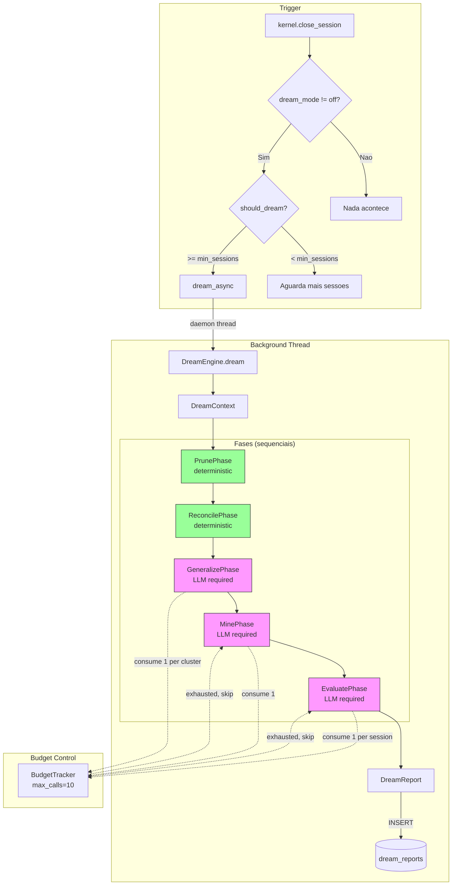
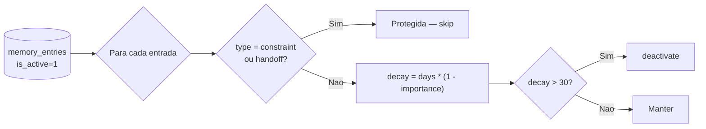
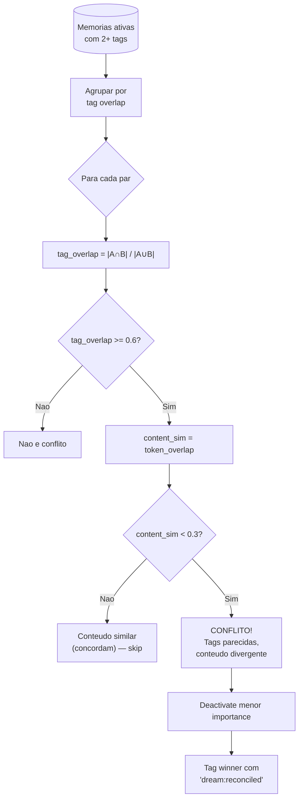
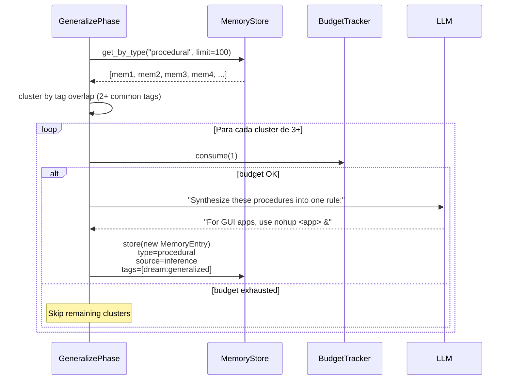
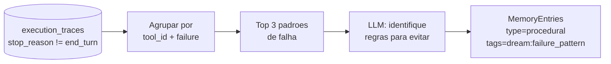
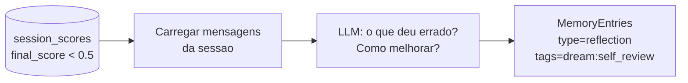
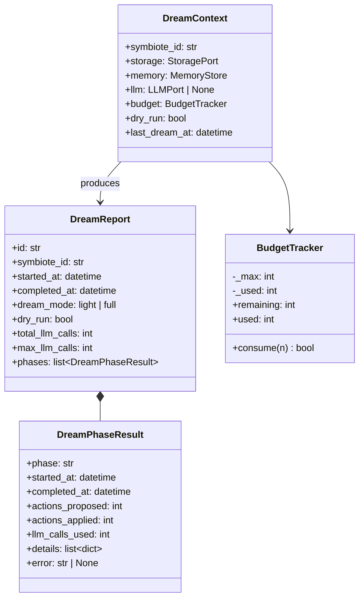
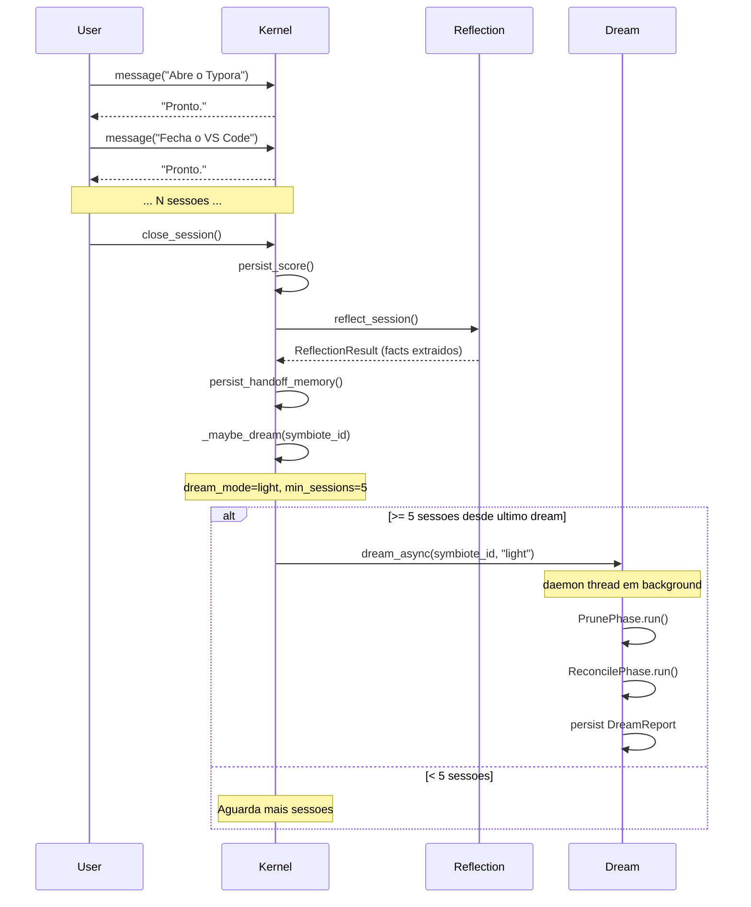

# Symbiote — Dream Mode

O Dream Mode e um motor de ruminacao em background que consolida, poda e melhora as memorias do agente fora do ciclo de sessao. Funciona como sono REM — enquanto o agente nao esta atendendo, ele "sonha" sobre o que aprendeu e busca maneiras de ser melhor.

## Toggle

O Dream Mode e controlado por symbiote via `EnvironmentConfig`:

| Campo | Tipo | Default | Descricao |
|-------|------|---------|-----------|
| `dream_mode` | `off / light / full` | `off` | Nivel de ativacao |
| `dream_max_llm_calls` | `1-50` | `10` | Budget maximo de chamadas LLM por ciclo |
| `dream_min_sessions` | `1-100` | `5` | Sessoes fechadas necessarias para disparar |

- **off**: Nunca roda. Zero custo.
- **light**: Apenas fases deterministas (Prune + Reconcile). Zero chamadas LLM.
- **full**: Todas as 5 fases, com budget controlado pelo `BudgetTracker`.

## Arquitetura



## Fases em Detalhe

### Phase 1 — Prune (Deterministic)

Desativa memorias obsoletas baseado em uma formula de decay:

```
decay = days_since_last_used * (1 - importance)
```

Se `decay > 30`, a memoria e desativada (soft-delete). Memorias do tipo `constraint` e `handoff` sao protegidas — nunca sao podadas.



**Exemplos**:
- Memoria com importance=0.3, 60 dias sem uso: `60 * 0.7 = 42` → podada
- Memoria com importance=0.9, 60 dias sem uso: `60 * 0.1 = 6` → mantida
- Constraint com importance=0.1, 100 dias: protegida → mantida

### Phase 2 — Reconcile (Deterministic)

Detecta memorias conflitantes (mesmos tags, conteudo divergente) e resolve mantendo a de maior importance.



### Phase 3 — Generalize (LLM)

Encontra clusters de 3+ memorias procedurais similares e pede ao LLM para criar uma abstracao de nivel mais alto.



### Phase 4 — Mine (LLM)

Analisa `execution_traces` com falhas recorrentes e gera memorias procedurais para evitar padroes problematicos.



### Phase 5 — Evaluate (LLM)

Rele sessoes com score baixo (< 0.5) e gera insights de auto-melhoria.



## DreamReport — Output

Cada ciclo de dream produz um `DreamReport` persistido na tabela `dream_reports`:



## Dry-Run Mode

O `dry_run=True` faz todas as fases **proporem** acoes sem **aplicar** nenhuma. Util para inspecionar o que o Dream Mode faria antes de ativar em producao.

```python
report = kernel.dream(symbiote_id, dry_run=True)
for phase in report.phases:
    print(f"{phase.phase}: {phase.actions_proposed} propostas, {phase.actions_applied} aplicadas")
    for detail in phase.details:
        print(f"  → {detail}")
```

## Integracao com o Ciclo de Vida



## Notas

- O Dream Mode **nunca bloqueia** uma sessao ativa — roda em daemon thread.
- O `BudgetTracker` e a protecao contra custo descontrolado de API. Se o budget se esgota na Phase 3, as Phases 4 e 5 sao automaticamente puladas.
- Memorias criadas pelo Dream Mode usam `source="inference"` — distinguindo-as de memorias de usuario (`source="user"`) ou sistema (`source="system"`).
- O `should_dream()` verifica 3 condicoes: (1) dream_mode != off, (2) nenhum dream ativo pro mesmo symbiote, (3) >= min_sessions desde o ultimo dream.
