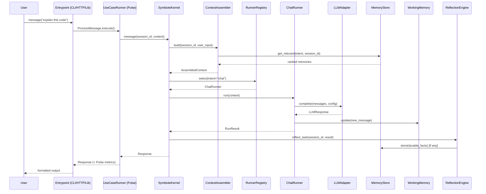

# Diagrama de Arquitetura — Symbiote

```mermaid
graph TB
    subgraph External["External"]
        User["👤 Desenvolvedor / Operador"]
        LLMProvider["🤖 LLM Provider<br/>(Anthropic / OpenAI / OpenRouter)"]
    end

    subgraph Interface["Interface Layer"]
        direction LR
        CLI["CLI<br/>symbiote create<br/>symbiote session start<br/>symbiote message"]
        HTTP["HTTP API<br/>POST /symbiotes<br/>POST /sessions<br/>POST /sessions/:id/messages"]
        PyAPI["Python API<br/>kernel.create_symbiote()<br/>kernel.start_session()<br/>kernel.message()"]
    end

    subgraph UseCases["Use Cases (ForgeBase UseCaseRunner)"]
        direction LR
        UC_Create["CreateSymbiote"]
        UC_Session["ManageSession"]
        UC_Message["ProcessMessage"]
        UC_Reflect["RunReflection"]
        UC_Export["ExportState"]
    end

    subgraph Domain["Domain (Pure — no I/O)"]
        direction TB

        subgraph Core["core/"]
            Kernel["SymbioteKernel"]
            Identity["IdentityManager"]
            Session["SessionManager"]
            Context["ContextAssembler"]
            Reflection["ReflectionEngine"]
            Capabilities["CapabilitySurface<br/>Learn | Teach | Chat<br/>Work | Show | Reflect"]
        end

        subgraph Memory["memory/"]
            Store["MemoryStore"]
            Working["WorkingMemory"]
            Retrieval["MemoryRetrieval<br/>rank by scope + importance<br/>+ recency + tags"]
        end

        subgraph Knowledge["knowledge/"]
            KService["KnowledgeService"]
        end

        subgraph Workspace["workspace/"]
            WManager["WorkspaceManager"]
            Artifacts["ArtifactManager"]
        end

        subgraph Environment["environment/"]
            EManager["EnvironmentManager"]
            Policy["PolicyGate"]
            Tools["ToolGateway"]
        end

        subgraph Runners["runners/"]
            Registry["RunnerRegistry"]
            Chat["ChatRunner"]
            Task["TaskRunner"]
            Process["ProcessRunner"]
        end

        subgraph ProcessEng["process/"]
            Engine["ProcessEngine"]
            Defs["Process Definitions<br/>chat_session<br/>research_task<br/>artifact_generation<br/>review_task<br/>workspace_task"]
        end
    end

    subgraph Ports["Ports (Interfaces)"]
        StoragePort["StoragePort"]
        LLMPort["LLMPort"]
        SemanticPort["SemanticRecallPort"]
    end

    subgraph AdapterLayer["Adapters"]
        SQLiteAdapter["SQLiteAdapter"]
        ForgeLLM["ForgeLLMAdapter"]
        MockLLM["MockLLMAdapter"]
        SemanticMock["LocalSemanticAdapter<br/>(keyword-based MVP)"]
        MarkdownExport["MarkdownExporter"]
    end

    subgraph Infra["Infrastructure"]
        DB[("symbiote.db<br/>SQLite")]
        FS[("Filesystem<br/>.symbiote/<br/>workspaces/<br/>artifacts/<br/>exports/")]
        LogFile[("Logs<br/>structlog → JSON")]
    end

    %% User → Interface
    User --> CLI
    User --> HTTP
    User --> PyAPI

    %% Interface → UseCases
    CLI --> UC_Create
    CLI --> UC_Session
    CLI --> UC_Message
    HTTP --> UC_Create
    HTTP --> UC_Session
    HTTP --> UC_Message
    PyAPI --> UC_Create
    PyAPI --> UC_Session
    PyAPI --> UC_Message

    %% UseCases → Domain
    UC_Create --> Identity
    UC_Session --> Session
    UC_Message --> Context
    UC_Message --> Registry
    UC_Reflect --> Reflection
    UC_Export --> MarkdownExport

    %% Domain internal
    Kernel --> Capabilities
    Context --> Store
    Context --> KService
    Context --> Identity
    Context --> Retrieval
    Reflection --> Store
    Reflection --> Session
    Chat --> Working
    Task --> Tools
    Tools --> Policy
    Policy --> EManager
    Process --> Engine
    Engine --> Defs
    Registry --> Chat
    Registry --> Task
    Registry --> Process
    WManager --> Artifacts

    %% Domain → Ports
    Store --> StoragePort
    KService --> StoragePort
    Identity --> StoragePort
    Session --> StoragePort
    Chat --> LLMPort
    Retrieval --> SemanticPort

    %% Ports → Adapters
    StoragePort --> SQLiteAdapter
    LLMPort --> ForgeLLM
    LLMPort -.-> MockLLM
    SemanticPort --> SemanticMock

    %% Adapters → Infra
    SQLiteAdapter --> DB
    ForgeLLM --> LLMProvider
    MarkdownExport --> FS
    Artifacts --> FS

    %% Observability
    UC_Create -.-> LogFile
    UC_Message -.-> LogFile
```

## Fluxo de uma mensagem (runtime cycle)

```mermaid
sequenceDiagram
    participant U as User
    participant E as Entrypoint (CLI/HTTP/Lib)
    participant UCR as UseCaseRunner (Pulse)
    participant K as SymbioteKernel
    participant CA as ContextAssembler
    participant RR as RunnerRegistry
    participant CR as ChatRunner
    participant LLM as LLMAdapter
    participant MS as MemoryStore
    participant WM as WorkingMemory
    participant RE as ReflectionEngine

    U->>E: message("explain this code")
    E->>UCR: ProcessMessage.execute()
    UCR->>K: message(session_id, content)
    K->>CA: build(session_id, user_input)
    CA->>MS: get_relevant(intent, session_id)
    MS-->>CA: ranked memories
    CA-->>K: AssembledContext
    K->>RR: select(intent="chat")
    RR-->>K: ChatRunner
    K->>CR: run(context)
    CR->>LLM: complete(messages, config)
    LLM-->>CR: LLMResponse
    CR->>WM: update(new_message)
    CR-->>K: RunResult
    K->>RE: reflect_task(session_id, result)
    RE->>MS: store(durable_facts) [if any]
    K-->>UCR: Response
    UCR-->>E: Response (+ Pulse metrics)
    E-->>U: formatted output
```
