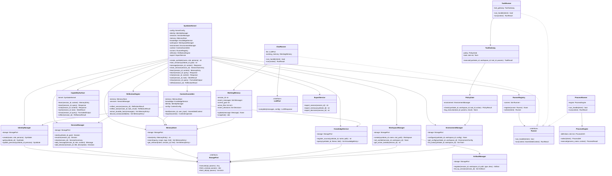

# Diagrama de Classes — Symbiote

```mermaid
classDiagram
    direction TB

    %% === CORE ===
    class SymbioteKernel {
        -config: KernelConfig
        -identity: IdentityManager
        -sessions: SessionManager
        -memory: MemoryStore
        -knowledge: KnowledgeService
        -workspace: WorkspaceManager
        -environment: EnvironmentManager
        -context: ContextAssembler
        -runners: RunnerRegistry
        -reflection: ReflectionEngine
        -export: ExportService
        +create_symbiote(name, role, persona) str
        +start_session(symbiote_id, goal) str
        +message(session_id, content) Response
        +close_session(session_id) SessionSummary
        +learn(session_id, content) MemoryEntry
        +teach(session_id, query) Response
        +chat(session_id, content) Response
        +work(session_id, task) WorkResult
        +show(session_id, query) FormattedOutput
        +reflect(session_id) ReflectionResult
    }

    class IdentityManager {
        -storage: StoragePort
        +create(name, role, persona) Symbiote
        +get(symbiote_id) Symbiote
        +update_persona(symbiote_id, persona) Symbiote
    }

    class SessionManager {
        -storage: StoragePort
        +start(symbiote_id, goal) Session
        +resume(session_id) Session
        +close(session_id) SessionSummary
        +add_message(session_id, role, content) Message
        +add_decision(session_id, title, description) Decision
    }

    class ContextAssembler {
        -memory: MemoryStore
        -knowledge: KnowledgeService
        -identity: IdentityManager
        -config: ContextConfig
        +build(session_id, user_input) AssembledContext
        +inspect(context) ContextInspection
    }

    class ReflectionEngine {
        -memory: MemoryStore
        -sessions: SessionManager
        +reflect_session(session_id) ReflectionResult
        +reflect_task(session_id, task_result) ReflectionResult
        -extract_durable_facts(messages) list~MemoryEntry~
        -discard_noise(candidates) list~MemoryEntry~
    }

    class CapabilitySurface {
        -kernel: SymbioteKernel
        +learn(session_id, content) MemoryEntry
        +teach(session_id, query) Response
        +chat(session_id, content) Response
        +work(session_id, task) WorkResult
        +show(session_id, query) FormattedOutput
        +reflect(session_id) ReflectionResult
    }

    %% === MEMORY ===
    class MemoryStore {
        -storage: StoragePort
        +store(entry: MemoryEntry) str
        +search(query, scope, tags, limit) list~MemoryEntry~
        +get_relevant(intent, session_id, limit) list~MemoryEntry~
    }

    class WorkingMemory {
        -session_id: str
        -recent_messages: list~Message~
        -current_goal: str
        -active_files: list~str~
        -recent_decisions: list~Decision~
        +update(message: Message) None
        +snapshot() dict
    }

    %% === KNOWLEDGE ===
    class KnowledgeService {
        -storage: StoragePort
        +register_source(symbiote_id, name, path) str
        +query(symbiote_id, theme, limit) list~KnowledgeEntry~
    }

    %% === WORKSPACE ===
    class WorkspaceManager {
        -storage: StoragePort
        +create(symbiote_id, name, root_path) Workspace
        +set_workdir(session_id, workspace_id) None
        +get_active_workdir(session_id) str
    }

    class ArtifactManager {
        -storage: StoragePort
        +register(session_id, workspace_id, path, type, desc) Artifact
        +list_by_session(session_id) list~Artifact~
    }

    %% === ENVIRONMENT ===
    class EnvironmentManager {
        -storage: StoragePort
        +configure(symbiote_id, workspace_id, config) None
        +get_config(symbiote_id, workspace_id) EnvironmentConfig
        +list_tools(symbiote_id, workspace_id) list~Tool~
    }

    class PolicyGate {
        -environment: EnvironmentManager
        +check(symbiote_id, workspace_id, tool_id, action) PolicyResult
        +log_execution(tool_id, params, result) None
    }

    class ToolGateway {
        -policy: PolicyGate
        -tools: dict~str, Tool~
        +execute(symbiote_id, workspace_id, tool_id, params) ToolResult
    }

    %% === RUNNERS ===
    class Runner {
        <<interface>>
        +can_handle(intent) bool
        +run(context: AssembledContext) RunResult
    }

    class RunnerRegistry {
        -runners: list~Runner~
        +register(runner: Runner) None
        +select(intent) Runner
    }

    class ChatRunner {
        -llm: LLMPort
        -working_memory: WorkingMemory
        +can_handle(intent) bool
        +run(context) RunResult
    }

    class TaskRunner {
        -tool_gateway: ToolGateway
        +can_handle(intent) bool
        +run(context) RunResult
    }

    class ProcessRunner {
        -engine: ProcessEngine
        +can_handle(intent) bool
        +run(context) RunResult
    }

    %% === PROCESS ===
    class ProcessEngine {
        -definitions: dict~str, ProcessDef~
        +select(intent) ProcessDef
        +execute(process_name, context) ProcessResult
    }

    %% === ADAPTERS (Ports) ===
    class StoragePort {
        <<interface>>
        +execute(sql, params) Any
        +fetch_one(sql, params) dict
        +fetch_all(sql, params) list~dict~
    }

    class LLMPort {
        <<interface>>
        +complete(messages, config) LLMResponse
    }

    class ExportService {
        +export_session(session_id) str
        +export_memory(symbiote_id) str
        +export_decisions(session_id) str
    }

    %% === RELATIONSHIPS ===
    SymbioteKernel --> IdentityManager
    SymbioteKernel --> SessionManager
    SymbioteKernel --> MemoryStore
    SymbioteKernel --> KnowledgeService
    SymbioteKernel --> WorkspaceManager
    SymbioteKernel --> EnvironmentManager
    SymbioteKernel --> ContextAssembler
    SymbioteKernel --> RunnerRegistry
    SymbioteKernel --> ReflectionEngine
    SymbioteKernel --> ExportService
    SymbioteKernel --> CapabilitySurface

    ContextAssembler --> MemoryStore
    ContextAssembler --> KnowledgeService
    ContextAssembler --> IdentityManager

    ReflectionEngine --> MemoryStore
    ReflectionEngine --> SessionManager

    WorkspaceManager --> ArtifactManager

    ToolGateway --> PolicyGate
    PolicyGate --> EnvironmentManager

    RunnerRegistry --> Runner
    ChatRunner ..|> Runner
    TaskRunner ..|> Runner
    ProcessRunner ..|> Runner

    ChatRunner --> LLMPort
    ChatRunner --> WorkingMemory
    TaskRunner --> ToolGateway
    ProcessRunner --> ProcessEngine

    IdentityManager --> StoragePort
    SessionManager --> StoragePort
    MemoryStore --> StoragePort
    KnowledgeService --> StoragePort
    WorkspaceManager --> StoragePort
    EnvironmentManager --> StoragePort

    WorkingMemory --> MemoryStore
```
