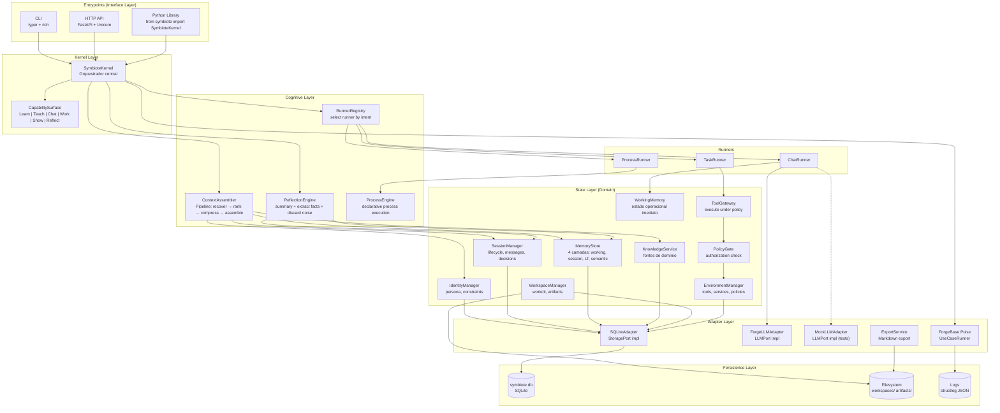

# Diagrama de Componentes — Symbiote

```mermaid
graph TB
    subgraph Entrypoints["Entrypoints (Interface Layer)"]
        CLI["CLI<br/>typer + rich"]
        HTTP["HTTP API<br/>FastAPI + Uvicorn"]
        LIB["Python Library<br/>from symbiote import SymbioteKernel"]
    end

    subgraph Kernel["Kernel Layer"]
        SK["SymbioteKernel<br/>Orquestrador central"]
        CAP["CapabilitySurface<br/>Learn | Teach | Chat | Work | Show | Reflect"]
    end

    subgraph Cognitive["Cognitive Layer"]
        CA["ContextAssembler<br/>Pipeline: recover → rank → compress → assemble"]
        RR["RunnerRegistry<br/>select runner by intent"]
        RE["ReflectionEngine<br/>summary + extract facts + discard noise"]
        PE["ProcessEngine<br/>declarative process execution"]
    end

    subgraph Runners["Runners"]
        CR["ChatRunner"]
        TR["TaskRunner"]
        PR["ProcessRunner"]
    end

    subgraph State["State Layer (Domain)"]
        IM["IdentityManager<br/>persona, constraints"]
        SM["SessionManager<br/>lifecycle, messages, decisions"]
        MS["MemoryStore<br/>4 camadas: working, session, LT, semantic"]
        WM["WorkingMemory<br/>estado operacional imediato"]
        KS["KnowledgeService<br/>fontes de domínio"]
        WSM["WorkspaceManager<br/>workdir, artifacts"]
        EM["EnvironmentManager<br/>tools, services, policies"]
        PG["PolicyGate<br/>authorization check"]
        TG["ToolGateway<br/>execute under policy"]
    end

    subgraph Adapters["Adapter Layer"]
        SQLite["SQLiteAdapter<br/>StoragePort impl"]
        FLLM["ForgeLLMAdapter<br/>LLMPort impl"]
        MockLLM["MockLLMAdapter<br/>LLMPort impl (tests)"]
        EXP["ExportService<br/>Markdown export"]
        Pulse["ForgeBase Pulse<br/>UseCaseRunner"]
    end

    subgraph Persistence["Persistence Layer"]
        DB[("symbiote.db<br/>SQLite")]
        FS[("Filesystem<br/>workspaces/ artifacts/")]
        Logs[("Logs<br/>structlog JSON")]
    end

    %% Entrypoints → Kernel
    CLI --> SK
    HTTP --> SK
    LIB --> SK

    %% Kernel → Cognitive
    SK --> CAP
    SK --> CA
    SK --> RR
    SK --> RE

    %% Cognitive → Runners
    RR --> CR
    RR --> TR
    RR --> PR
    PR --> PE

    %% Runners → State
    CR --> WM
    TR --> TG

    %% Cognitive → State
    CA --> IM
    CA --> SM
    CA --> MS
    CA --> KS
    RE --> MS
    RE --> SM

    %% State internal
    TG --> PG
    PG --> EM
    WSM --> FS

    %% State → Adapters
    IM --> SQLite
    SM --> SQLite
    MS --> SQLite
    KS --> SQLite
    WSM --> SQLite
    EM --> SQLite
    CR --> FLLM
    CR -.-> MockLLM

    %% Adapters → Persistence
    SQLite --> DB
    EXP --> FS
    Pulse --> Logs

    %% Cross-cutting
    SK --> Pulse
```
