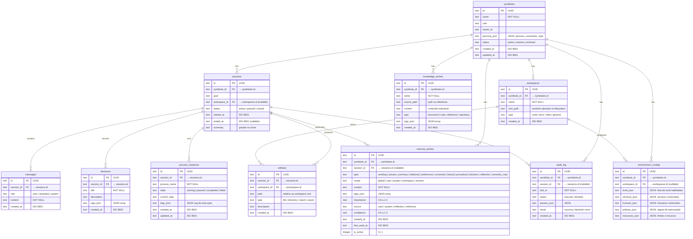

# Diagrama de Banco de Dados — Symbiote

```mermaid
erDiagram
    symbiotes {
        text id PK "UUID"
        text name "NOT NULL"
        text role
        text owner_id
        text persona_json "JSON: persona, constraints, style"
        text status "active | inactive | archived"
        text created_at "ISO 8601"
        text updated_at "ISO 8601"
    }

    sessions {
        text id PK "UUID"
        text symbiote_id FK "→ symbiotes.id"
        text goal
        text workspace_id FK "→ workspaces.id (nullable)"
        text status "active | paused | closed"
        text started_at "ISO 8601"
        text ended_at "ISO 8601 (nullable)"
        text summary "gerado no close"
    }

    messages {
        text id PK "UUID"
        text session_id FK "→ sessions.id"
        text role "user | assistant | system"
        text content "NOT NULL"
        text created_at "ISO 8601"
    }

    memory_entries {
        text id PK "UUID"
        text symbiote_id FK "→ symbiotes.id"
        text session_id FK "→ sessions.id (nullable)"
        text type "working | session_summary | relational | preference | constraint | factual | procedural | decision | reflection | semantic_note"
        text scope "global | user | project | workspace | session"
        text content "NOT NULL"
        text tags_json "JSON array"
        real importance "0.0 a 1.0"
        text source "user | system | reflection | inference"
        real confidence "0.0 a 1.0"
        text created_at "ISO 8601"
        text last_used_at "ISO 8601"
        integer is_active "0 | 1"
    }

    knowledge_entries {
        text id PK "UUID"
        text symbiote_id FK "→ symbiotes.id"
        text name "NOT NULL"
        text source_path "path ou referência"
        text content "conteúdo indexável"
        text type "document | note | reference | repository"
        text tags_json "JSON array"
        text created_at "ISO 8601"
    }

    workspaces {
        text id PK "UUID"
        text symbiote_id FK "→ symbiotes.id"
        text name "NOT NULL"
        text root_path "caminho absoluto no filesystem"
        text type "code | docs | data | general"
        text created_at "ISO 8601"
    }

    artifacts {
        text id PK "UUID"
        text session_id FK "→ sessions.id"
        text workspace_id FK "→ workspaces.id"
        text path "relativo ao workspace root"
        text type "file | directory | report | export"
        text description
        text created_at "ISO 8601"
    }

    environment_configs {
        text id PK "UUID"
        text symbiote_id FK "→ symbiotes.id"
        text workspace_id FK "→ workspaces.id (nullable)"
        text tools_json "JSON: lista de tools habilitadas"
        text services_json "JSON: serviços conectados"
        text humans_json "JSON: humanos conhecidos"
        text policies_json "JSON: regras de autorização"
        text resources_json "JSON: limites e recursos"
    }

    decisions {
        text id PK "UUID"
        text session_id FK "→ sessions.id"
        text title "NOT NULL"
        text description
        text tags_json "JSON array"
        text created_at "ISO 8601"
    }

    process_instances {
        text id PK "UUID"
        text session_id FK "→ sessions.id"
        text process_name "NOT NULL"
        text state "running | paused | completed | failed"
        text current_step
        text logs_json "JSON: log de execução"
        text created_at "ISO 8601"
        text updated_at "ISO 8601"
    }

    audit_log {
        text id PK "UUID"
        text symbiote_id FK "→ symbiotes.id"
        text session_id FK "→ sessions.id (nullable)"
        text tool_id "NOT NULL"
        text action "execute | blocked"
        text params_json "JSON"
        text result "success | blocked | error"
        text created_at "ISO 8601"
    }

    %% Relationships
    symbiotes ||--o{ sessions : "has"
    symbiotes ||--o{ memory_entries : "has"
    symbiotes ||--o{ knowledge_entries : "has"
    symbiotes ||--o{ workspaces : "has"
    symbiotes ||--o{ environment_configs : "has"
    symbiotes ||--o{ audit_log : "has"

    sessions ||--o{ messages : "contains"
    sessions ||--o{ artifacts : "produces"
    sessions ||--o{ decisions : "records"
    sessions ||--o{ process_instances : "runs"
    sessions ||--o{ memory_entries : "generates"
    sessions ||--o{ audit_log : "logs"

    workspaces ||--o{ artifacts : "stores"
    workspaces ||--o{ environment_configs : "configures"
```
